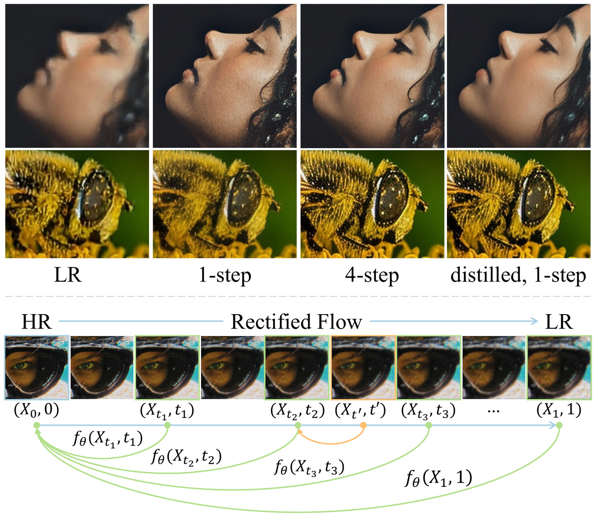

<div align="center">

# ⚡ FlowSR

### Fast Image Super-Resolution via Consistency Rectified Flow

<p>
  <a href="https://openaccess.thecvf.com/content/ICCV2025/html/Xu_Fast_Image_Super-Resolution_via_Consistency_Rectified_Flow_ICCV_2025_paper.html"></a>
  <a href="https://arxiv.org/abs/2605.12377"></a>
  <a href="https://huggingface.co/chunjie-spring/FlowSR"></a>
  <a href="#-license"></a>
</p>

Jiaqi Xu<sup>1,2,\*</sup> &nbsp;·&nbsp; Wenbo Li<sup>2,†</sup> &nbsp;·&nbsp; Haoze Sun<sup>2</sup> &nbsp;·&nbsp; Fan Li<sup>2</sup> &nbsp;·&nbsp; Zhixin Wang<sup>2</sup> &nbsp;·&nbsp; Long Peng<sup>2</sup> &nbsp;·&nbsp; Jingjing Ren<sup>3</sup> &nbsp;·&nbsp; Haoran Yang<sup>1</sup> &nbsp;·&nbsp; Xiaowei Hu<sup>4</sup> &nbsp;·&nbsp; Renjing Pei<sup>2,†</sup> &nbsp;·&nbsp; Pheng-Ann Heng<sup>1</sup>

<sup>1</sup>The Chinese University of Hong Kong &nbsp;&nbsp; <sup>2</sup>Huawei Noah's Ark Lab &nbsp;&nbsp; <sup>3</sup>HKUST (GZ) &nbsp;&nbsp; <sup>4</sup>South China University of Technology

<br>



<em>FlowSR casts super-resolution as a <strong>consistency rectified flow</strong> from LR to HR, producing high-quality results in as few as one step.</em>

</div>

> [!NOTE]
> This repository is a **minimal, inference-only third-party implementation** based on the paper. It is an independent re-implementation provided for non-commercial research, **not** an official author release.

## 📖 Paper

- **Title:** Fast Image Super-Resolution via Consistency Rectified Flow
- **Venue:** ICCV 2025
- **Paper:** [openaccess.thecvf.com](https://openaccess.thecvf.com/content/ICCV2025/html/Xu_Fast_Image_Super-Resolution_via_Consistency_Rectified_Flow_ICCV_2025_paper.html)
- **arXiv:** https://arxiv.org/abs/2605.12377
- **Citation:** [BibTeX below ↓](#-citation)

## 🛠️ Environment

Both [`uv`](https://docs.astral.sh/uv/) and conda are supported. Use whichever environment manager matches your workflow.

Using `uv`:

```bash
uv venv --python 3.12
source .venv/bin/activate
uv pip install -e .
```

If your CUDA setup needs a specific PyTorch wheel, install the matching PyTorch build first, then install this package:

```bash
uv pip install torch torchvision --index-url https://download.pytorch.org/whl/cu126
uv pip install -e .
```

Using conda with a CUDA 12.6 PyTorch environment:

```bash
conda create -n flowsr python=3.12 -y
conda activate flowsr
pip install torch torchvision --index-url https://download.pytorch.org/whl/cu126
pip install -e .
```

If your machine needs a different CUDA or CPU-only PyTorch build, install the matching PyTorch package first, then run `pip install -e .`.

Once the package is installed, FlowSR can be invoked two equivalent ways in **either** environment: the console scripts `flowsr-infer` / `flowsr-metrics`, or the module form `python -m flowsr.infer` / `python -m flowsr.metrics`. Activate your environment first — `source .venv/bin/activate` (uv) or `conda activate flowsr` (conda) — then run either form. The examples below use the module form; substitute the console script if you prefer.

> [!IMPORTANT]
> The default device is `cuda`; the model targets a GPU. CPU-only runs are not a supported path.

## 📥 Checkpoint

The FlowSR checkpoint is hosted on the Hugging Face Hub. Download it into `checkpoints/`:

```bash
uv pip install -U huggingface_hub   # or: pip install -U huggingface_hub

hf download chunjie-spring/FlowSR flowsr.safetensors --local-dir checkpoints
```

> [!NOTE]
> The checkpoint is hosted at the Hugging Face repository `chunjie-spring/FlowSR`. After downloading, it must live at:
>
> ```text
> checkpoints/flowsr.safetensors
> ```

Validate it before running inference:

```bash
python -m flowsr.infer --checkpoint checkpoints/flowsr.safetensors --check-checkpoint-only
```

## 🚀 Inference

The default base model is `Manojb/stable-diffusion-2-1-base`, a drop-in re-upload of the
weights from the original `stabilityai/stable-diffusion-2-1-base` repository, which has been
removed from the Hugging Face Hub. Override it with `--base-model` if you host the weights elsewhere.

### Single image:

```bash
python -m flowsr.infer \
  --input path/to/lr.png \
  --output outputs \
  --checkpoint checkpoints/flowsr.safetensors \
  --base-model Manojb/stable-diffusion-2-1-base \
  --flow-scheduler-model stabilityai/stable-diffusion-3-medium-diffusers
```

### Folder:

```bash
python -m flowsr.infer \
  --input path/to/lr_folder \
  --output outputs \
  --checkpoint checkpoints/flowsr.safetensors
```

Outputs are written as PNG files in the output directory.

**Useful options:**

- `--scale`: upsampling scale, default `4`
- `--device`: default `cuda`
- `--dtype`: `fp16`, `bf16`, or `fp32`, default `bf16`
- `--num-inference-steps`: default `1`
- `--guidance-scale`: default `1.0`
- `--align-method`: `wavelet`, `adain`, or `none`, default `wavelet`

## 📊 Metrics

### Install the optional metric dependencies:

```bash
uv pip install -e ".[metrics]"
```

With conda:

```bash
pip install -e ".[metrics]"
```

### Evaluate SR outputs against GT images:

```bash
python -m flowsr.metrics \
  --sr outputs/StableSR-TestSets/RealSRVal_crop128 \
  --gt data/StableSR-TestSets/StableSR_testsets/RealSRVal_crop128/test_HR \
  --output-dir metrics \
  --metrics psnr ssim lpips dists fid niqe musiq maniqa clipiqa
```

The metric script matches SR and GT images by filename stem, writes a timestamped log file, and saves a JSON summary to `metrics/flowsr_metrics.json`.

## 🗂️ Benchmarks

For public evaluation examples, use the **StableSR test sets** hosted on Hugging Face:

- https://huggingface.co/datasets/Iceclear/StableSR-TestSets

The dataset card lists *DIV2K_Val*, *RealSR Val*, *DRealSR Val*, and *DPED Val*, and is licensed under S-Lab License 1.0.

### Example download command:

```bash
uv pip install -U huggingface_hub   # or: pip install -U huggingface_hub

hf download Iceclear/StableSR-TestSets \
  --repo-type dataset \
  --local-dir data/StableSR-TestSets
```

After download, the local directory contains the dataset card and the zip archive:

```text
data/StableSR-TestSets/
├── README.md
└── StableSR_testsets.zip
```

### Extract the archive in place:

```bash
unzip data/StableSR-TestSets/StableSR_testsets.zip -d data/StableSR-TestSets
```

Inspect the extracted layout before running inference:

```bash
find data/StableSR-TestSets -maxdepth 4 -type d | sort
find data/StableSR-TestSets -maxdepth 5 -type f \( -iname "*.png" -o -iname "*.jpg" -o -iname "*.jpeg" \) | head
```

The extracted archive includes directories such as:

```text
data/StableSR-TestSets/StableSR_testsets/
├── DIV2K_V2_val
├── DPEDiphoneValSet_crop128
├── DrealSRVal_crop128
├── RealSRVal_crop128
└── StableSR_w0.5_results
```

This repository's examples focus on `RealSRVal_crop128` and `DrealSRVal_crop128`. Each has paired low-resolution and high-resolution folders:

```text
RealSRVal_crop128/
├── test_HR
└── test_LR

DrealSRVal_crop128/
├── test_HR
└── test_LR
```

The inference CLI expects `--input` to be one image file or one directory that directly contains low-quality images. Point it at the extracted `test_LR` folder for the split you want to process, not at the dataset root.

### Run `RealSR Val`:

```bash
python -m flowsr.infer \
  --input data/StableSR-TestSets/StableSR_testsets/RealSRVal_crop128/test_LR \
  --output outputs/StableSR-TestSets/RealSRVal_crop128 \
  --checkpoint checkpoints/flowsr.safetensors
```

### Run `DRealSR Val`:

```bash
python -m flowsr.infer \
  --input data/StableSR-TestSets/StableSR_testsets/DrealSRVal_crop128/test_LR \
  --output outputs/StableSR-TestSets/DrealSRVal_crop128 \
  --checkpoint checkpoints/flowsr.safetensors
```

### Evaluate `RealSR Val` against `test_HR` after inference:

```bash
python -m flowsr.metrics \
  --sr outputs/StableSR-TestSets/RealSRVal_crop128 \
  --gt data/StableSR-TestSets/StableSR_testsets/RealSRVal_crop128/test_HR \
  --output-dir metrics \
  --metrics psnr ssim lpips dists fid niqe musiq maniqa clipiqa
```

### Evaluate `DRealSR Val` against `test_HR` after inference:

```bash
python -m flowsr.metrics \
  --sr outputs/StableSR-TestSets/DrealSRVal_crop128 \
  --gt data/StableSR-TestSets/StableSR_testsets/DrealSRVal_crop128/test_HR \
  --output-dir metrics \
  --metrics psnr ssim lpips dists fid niqe musiq maniqa clipiqa
```

## 🧯 Troubleshooting

- `Could not load checkpoint`: the checkpoint file is missing, truncated, or not a valid FlowSR safetensors checkpoint.
- CUDA out of memory: try a smaller input image, `--dtype bf16`, or reduce `--latent-tile-size`.
- Hugging Face download failures: log in with `hf auth login` or pre-download the base model and scheduler to a local cache.
- Commercial usage questions: this repository uses a non-commercial software license.

## 📁 Project Structure

```text
FlowSR/
├── README.md                 # this file
├── LICENSE                   # PolyForm Noncommercial 1.0.0
├── pyproject.toml            # package metadata, dependencies, console scripts
├── assets/
│   └── teaser.jpg
├── checkpoints/
│   └── .gitkeep              # download flowsr.safetensors here
├── flowsr/
│   ├── __init__.py
│   ├── defaults.py           # shared inference defaults (base model, prompts)
│   ├── infer.py              # inference CLI + image I/O   (flowsr-infer)
│   ├── model.py              # FlowSR pipeline: UNet / VAE / text encoder + LoRA
│   ├── checkpoint.py         # safetensors checkpoint loader
│   ├── color.py              # wavelet / adain color correction
│   └── metrics.py            # optional pyiqa evaluation    (flowsr-metrics)
└── tests/
    ├── test_cli_utils.py
    └── test_metrics_utils.py
```

The inference path is `infer.py → model.py → checkpoint.py`, with `color.py` applied
as post-processing. `metrics.py` is optional and only used with the `[metrics]` extra.

## 📦 Scope

**Included:**

- Minimal inference code
- LoRA checkpoint loading
- Image and folder inference CLI
- Checkpoint validation CLI
- Optional image-quality metric evaluation script
- Public setup and usage documentation

**Not included:**

- Training code
- Dataset generation code
- Benchmark datasets
- Notebooks
- Metrics reports
- Internal experiment logs

## 🙏 Acknowledgments

This implementation builds on the excellent work of:

- [OSEDiff](https://github.com/cswry/OSEDiff)
- [S3Diff](https://github.com/ArcticHare105/S3Diff)
- [PCM (Phased Consistency Model)](https://github.com/G-U-N/Phased-Consistency-Model)

## 📌 Citation

If you find this work useful, please cite the paper:

```bibtex
@inproceedings{xu2025fast,
  title={Fast Image Super-Resolution via Consistency Rectified Flow},
  author={Xu, Jiaqi and Li, Wenbo and Sun, Haoze and Li, Fan and Wang, Zhixin and Peng, Long and Ren, Jingjing and Yang, Haoran and Hu, Xiaowei and Pei, Renjing and others},
  booktitle={Proceedings of the IEEE/CVF International Conference on Computer Vision},
  pages={11755--11765},
  year={2025}
}
```

## 📄 License

This repository is released under the [PolyForm Noncommercial License 1.0.0](LICENSE). It is intended for non-commercial research use. For commercial use, please contact the repository owner.
</content>
</invoke>
